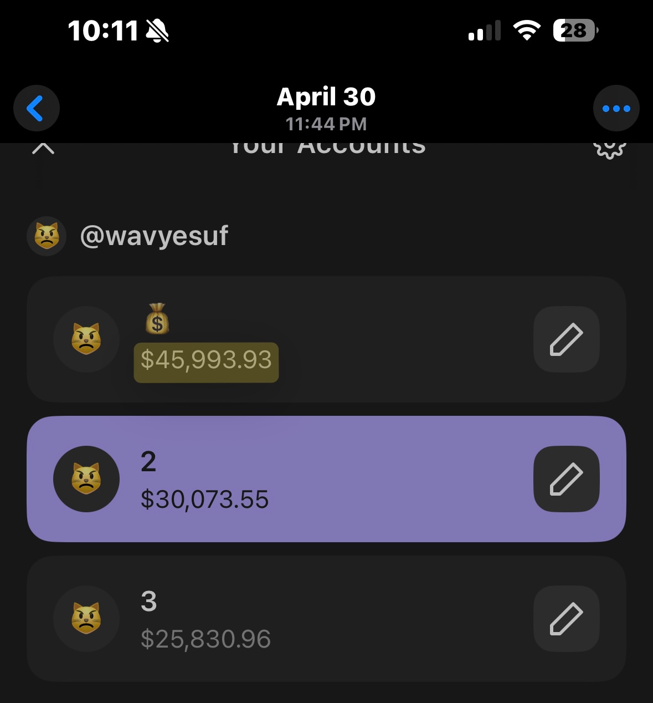

# Solana Ecosystem: A Technical Infrastructure Case Study
***

**The Verification Paradox ($TRUMP Launch)**
In January 2025, a presidential account tweeted a ticker and a link for an official token. The lack of an immediate Contract Address (CA) created a massive "Verification Paradox" where the market split 50/50. 

**Technical Analysis:** Top-tier traders suspected a hack and called for an exit due to the unusual launch style, while others recognized the authenticity and captured the expansion. This taught me that **Social Sentiment is a noisy Oracle.** In this instance, I saw how FUD can be used as a "shakeout" to test a coin's holder base. If a single tweet can make a holder sell without an objective reason, that asset's "social uptime" is low. Filtering this noise is a core technical skill I now prioritize.

  

***

**The Infrastructure Pivot (Piotrostr, Listen & ARC)**
Moving away from manual sentiment-trading, I began researching the technical "plumbing" of the network. I focused on **Piotrostr (Piotrek)**, a lead engineer in the DeFAI (Decentralized AI Finance) space whose work is industry-leading. I aligned my portfolio with the infrastructure-side by holding **$LISTEN** and **$ARC** (AI Rig Complex). Studying Piotrek's GitHub—specifically the `listen-rs` framework—showed me how Rust-based agents manage on-chain liquidity. This moved my focus from "trading tickers" to "analyzing systems."

***

**Capital Scaling & Systemic Failure ($100k Peak)**
Applying this infrastructure-first research allowed me to scale a seed capital of **$2,200 to a peak of over $100,000** across three active Phantom wallets. This was a significant "Proof of Concept" for data-driven allocation, but the subsequent drawdown back to $10k revealed a massive **Infrastructure Gap**. Managing six figures manually in a 24/7 market is unsustainable; without automated risk-management and real-time monitoring (SRE), a human-led system is prone to failure.

***

**Current Research: Agentic SRE (Trophy Tomato Phase 2)**
I am currently tracking Martin DeVido’s **$SOL (Trophy Tomato)** as it enters Phase 2. This is the most impressive "Agentic" experiment I've witnessed—a biological parallel to Site Reliability Engineering. I observe how the AI agent (Claude) monitors sensors (CO2, moisture, light) and performs **autonomous hardware resets** when the system crashes, such as the Day 34 recursion error. This represents the future: self-healing infrastructure where AI manages the physical world.

***
**© 2026 Yesuf Hassen | IT Student @ NOVA | Presidential Scholar**
