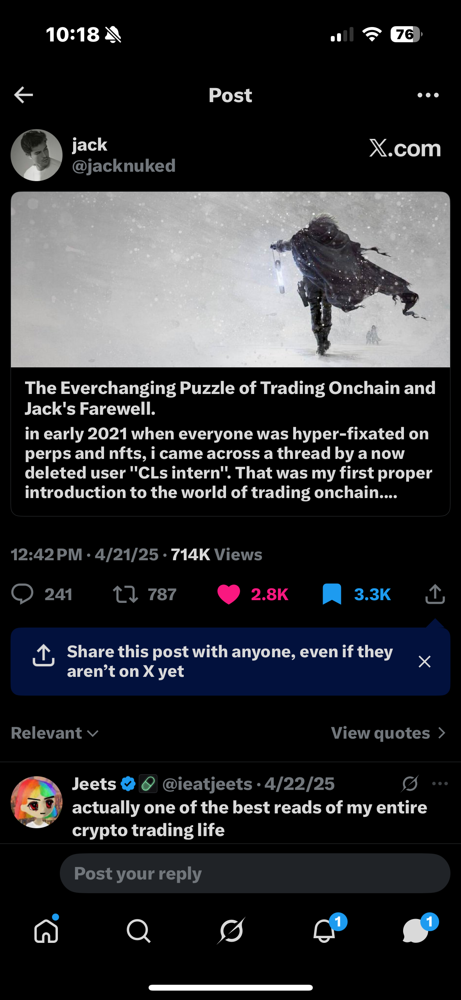

# Solana Ecosystem: A Technical Infrastructure Case Study
***

**1. The Verification Paradox & Social Oracle Failure ($TRUMP)**
**The Event:** In January 2025, a high-profile ticker launch created a "Verification Paradox." Without an immediate Contract Address (CA), the market was forced to rely on social media as a primary data source.

**Systems Analysis:** I analyzed the split between "Social Sentiment" and "Network Reality." While prominent traders like **Taco** signaled a "Liquidity Drain" (FUD), the underlying volume metrics ($500M+) suggested a massive expansion. 
* **The Takeaway:** I identified a "conviction threshold"—if a single tweet can make a holder sell without an objective reason, the system's "social uptime" is low. Filtering this noise is a core technical skill I now prioritize.

  
  
  

***

**2. Algorithmic Infrastructure: Piotrostr (Listen-rs & ARC)**
**The Research:** To solve the latency issues of manual trading, I pivoted to **Infrastructure Analysis**, focusing on the work of **Piotrostr (Piotrek)**. 

**Systems Analysis:** I performed a deep-dive into the **Listen-rs** framework and the **AI Rig Complex (ARC)**. 
* **Technical Stack:** Analyzing Piotrek's GitHub—specifically his implementation of high-performance Rust cores and Jito MEV bundles—demonstrated how AI agents (DeFAI) achieve real-time **Observability**. 
* **Implementation:** I aligned my portfolio with the $LISTEN and $ARC partnership, treating these not as "coins," but as "infrastructure bets."

  
  

***

**3. Scaling & Post-Mortem on Manual Systems ($100k Peak)**
**The Event:** By June 2025, my infrastructure-first research yielded a **4,400% return**, scaling **$2,200 to over $100,000** across three active Phantom wallets.

**Technical Post-Mortem:** This peak was achieved by applying strategies learned from top-tier traders. Specifically, I documented a case study on a trader whose methodology focused on identifying "Alpha" in infrastructure-heavy projects, which provided the blueprint for my portfolio's growth.
* **The Gap:** However, the subsequent drawdown back to $10k was a classic **Systems Failure**. I was managing a six-figure, high-concurrency system manually in a 24/7 market. 
* **The Lesson:** In the absence of automated risk-management and real-time monitoring (SRE), a human-led system is prone to catastrophic failure. 

  
  

***

**4. Future Research: Agentic SRE (Trophy Tomato Phase 2)**
**Current Focus:** I am currently documenting Martin DeVido’s **$SOL (Trophy Tomato)** project as it transitions into Phase 2 after its initial 100-day cycle.

**Systems Analysis:** This is the ultimate biological parallel to **Site Reliability Engineering (SRE)**. 
* **Observability:** An AI agent (Claude) monitors physical sensors (CO2, moisture, temperature).
* **Remediation:** I am tracking the agent's ability to perform **autonomous hardware resets** (e.g., the Day 34 recursion error). This represents the frontier: self-healing infrastructure where AI agents bridge the gap between digital logic and physical system health.

  
  

***
**© 2026 Yesuf Hassen | IT Student @ NOVA | Presidential Scholar**
