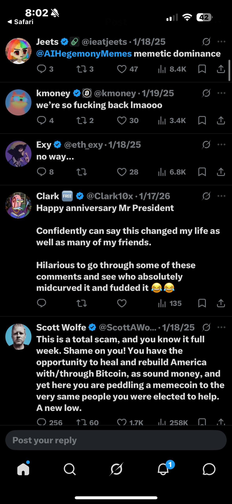
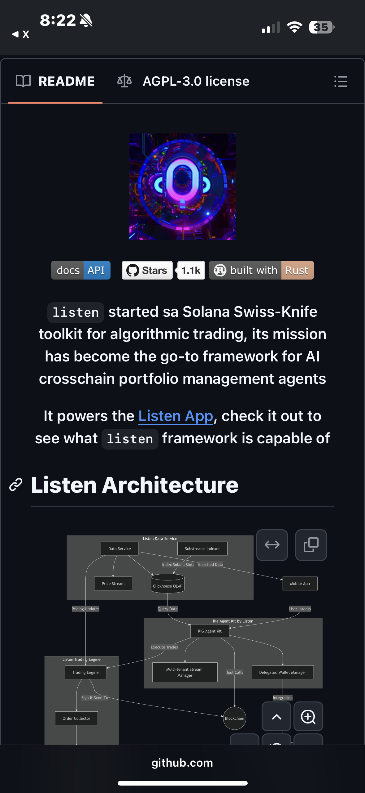
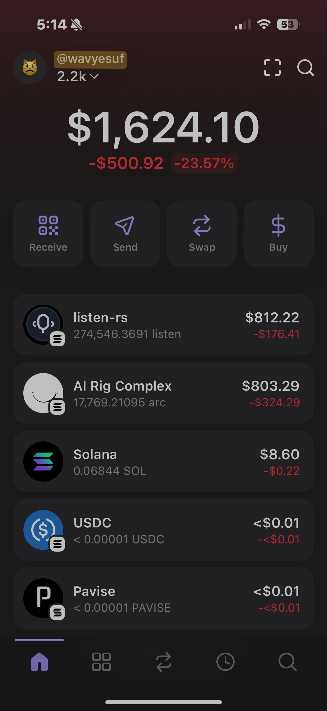
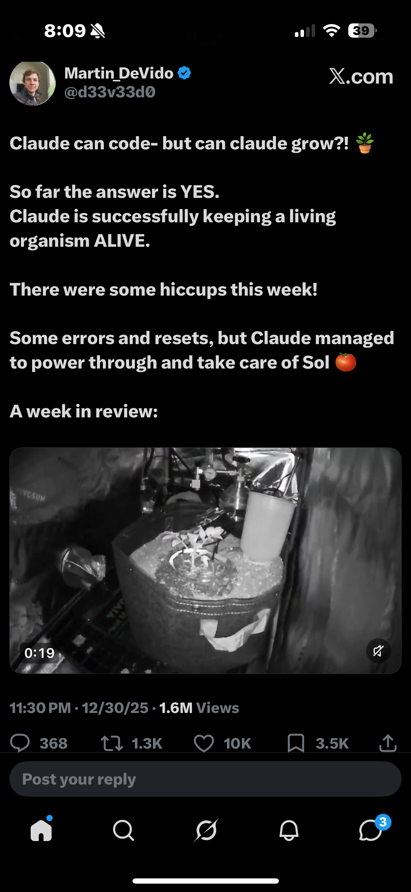

# Solana Ecosystem: A Technical Infrastructure Case Study
***

## **1. The Verification Paradox & The "Funder’s" Bias ($TRUMP)**

**The Event:** In January 2025, a presidential account tweeted a ticker and a link for an official token. The lack of an immediate Contract Address (CA) combined with the sheer absurdity of the event created a massive "Verification Paradox."

**Systems Analysis:** I personally fell victim to **Cognitive Bias**. The event was so outside the norm of presidential behavior that I, along with many others, dismissed it as a hack or a scam. As shown in the attached posts, the market split into two distinct camps:

* **The FUD (Fear, Uncertainty, and Doubt) Camp:** This side (which I was initially in) "faded" the entry, convinced the risk of a systemic exploit was too high.
* **The Opportunity Camp:** Some participants ignored the social noise, recognized the authenticity of the source, and captured a **90x return** from the moment It was tweeted to its eventual peak.

**The Technical Takeaway:** This experience served as my high-stakes introduction to the crypto ecosystem—a baptism by fire that demonstrated the "Logic Ceiling" of relying on social sentiment as an Oracle. Missing a massive expansion due to human bias and external noise taught me that in a 24/7 market, emotion-driven execution is a systemic vulnerability. 

Rather than discouraging me, this anomaly sparked a deep fascination with how these decentralized systems actually function. I realized that to find sustainable Alpha, I needed to look past the surface-level hype and understand the underlying mechanics of the network. This shift in perspective drove me to dive deeper into the space, eventually leading me away from the "noise" and toward the technical infrastructure that powers it all.

  
  
  

***
## **2. Algorithmic Infrastructure: piotrostr (Listen-rs & ARC)**

**The Research:** After experiencing the volatility of manual, sentiment-based entries, I pivoted to **Infrastructure Analysis**. I stumbled upon a niche sector of the Solana ecosystem known as **DeFAI** (Decentralized Finance + AI), which focused on building high-performance tools for autonomous agents. My research led me to **piotrostr**, a lead engineer whose GitHub was gaining significant traction.

**Systems Analysis:** I performed a deep-dive into the **Listen-rs** ($LISTEN) framework and the **AI Rig Complex** ($ARC).
* **$listen (listen-rs):** Originally a "Solana Swiss Army Knife" for algorithmic trading, it evolved into a go-to framework for AI-powered cross-chain portfolio management. It provides the low-level "plumbing" for real-time transaction monitoring and fast execution using **Jito MEV bundles**.
* **$arc (AI Rig Complex):** A modular AI agent framework (or "rig") designed for building autonomous applications. It is built in Rust for maximum performance, allowing agents to execute trades and manage wallets programmatically.

**The Implementation:** I was fascinated by how $listen was designed for **plug-and-play integration** with the $arc rig framework. This synergy allows developers to create agents that don't just "chat," but actively analyze and operate across chains with machine efficiency. 

**The Technical Takeaway:** Beyond the tech, I observed the market's reaction to high-quality engineering. When piotrostr’s GitHub reached an impressive **1.1k stars**, it served as a technical validation that drove the valuation of $LISTEN upward. Seeing the strategic partnership between the lean $listen infrastructure and the high-valuation $arc ecosystem taught me how technical interoperability creates massive market value. I aligned my portfolio with these "infrastructure bets," focusing on how I could eventually implement these tools to automate my own trading and remove human latency from the equation.

  
  

***

## **3. Scaling & Post-Mortem on Manual Systems ($100k Peak)**

**The Event:** By June 2025, my transition from a retail mindset to an infrastructure-first approach yielded a **4,400% return**, scaling a seed capital of **$2,200 to over $100,000** across three active Phantom wallets.

**Systems Analysis:** My research into $LISTEN and $ARC taught me that the crypto market functions as an "Attention Economy." I learned that success depends on front-running the curve by identifying undervalued assets based on objective technical pillars: the quality of a GitHub repository, the developer’s track record, and the actual utility of the product. 

**Market Dynamics:** I began to synthesize different market drivers to gain an edge:
* **Fundamental Analysis:** Evaluating "staying power" in narratives, comparing emergent plays to established benchmarks like $WIF and $PEPE.
* **Social Architecture:** Monitoring the influence of KOLs (Key Opinion Leaders) and how their backing can manipulate or sustain momentum.
* **Technical Analysis (TA):** I developed the ability to recognize on-chain patterns, providing a systematic edge for entering and exiting plays with precision.

**Technical Post-Mortem:** During this period, I followed insights from respected market analysts like **Jack** (as seen in the documentation), whose perspective on the "ever-changing puzzle" of on-chain liquidity helped refine my strategy. However, reaching the $100k milestone created a false sense of security.

**The Lesson:** Despite the massive growth, the portfolio eventually suffered due to **poor risk management**. I realized that while my "entry" logic was sound, my "systemic guardrails" were non-existent. Managing a six-figure, high-concurrency portfolio manually in a 24/7 market is a recipe for failure without a strict exit framework. I have since corrected these operational flaws, treating risk management as a technical requirement rather than an afterthought.

  
  

***

**4. Future Research: Agentic SRE (Trophy Tomato Phase 2)**
**Current Focus:** I am currently documenting Martin DeVido’s **$SOL (Trophy Tomato)** project as it transitions into Phase 2 after its initial 100-day cycle.

**Systems Analysis:** This is the ultimate biological parallel to **Site Reliability Engineering (SRE)**. 
* **Observability:** An AI agent (Claude) monitors physical sensors (CO2, moisture, temperature).
* **Remediation:** I am tracking the agent's ability to perform **autonomous hardware resets** (e.g., the Day 34 recursion error). This represents the frontier: self-healing infrastructure where AI agents bridge the gap between digital logic and physical system health.

  
  

***
**© 2026 Yesuf Hassen | IT Student @ NOVA | Presidential Scholar**
